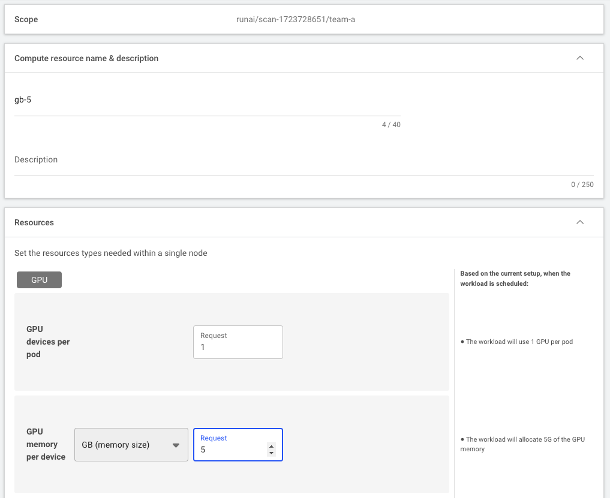

# Quickstart: Launch Workloads with GPU Fractions
 
## Introduction

Run:ai provides a Fractional GPU sharing system for containerized workloads on Kubernetes. The system supports workloads running CUDA programs and is especially suited for lightweight AI tasks such as inference and model building. The fractional GPU system transparently gives data science and AI engineering teams the ability to run multiple workloads simultaneously on a single GPU, enabling companies to run more workloads such as computer vision, voice recognition and natural language processing on the same hardware, lowering costs.

Run:ai’s fractional GPU system effectively creates logical GPUs, with their own memory and computing space that containers can use and access as if they were self-contained processors. This enables several workloads to run in containers side-by-side on the same GPU without interfering with each other. The solution is transparent, simple, and portable; it requires no changes to the containers themselves.

A typical use-case could see a couple of Workloads running on the same GPU, meaning you could multiply the work with the same hardware. 

To submit a workload you can use the Run:ai _command-line interface (CLI)_ or the _Run:ai user interface_. 

## Prerequisites

To complete this Quickstart, the [Platform Administrator](../../platform-admin/overview.md) will need to provide you with:

* _Researcher_ access to Run:ai 
* To a Project named "team-a"
* With at least 1 GPU assigned to the project. 
* A link to the Run:ai Console. E.g. [https://acme.run.ai](https://acme.run.ai).
* To complete this Quickstart __via the CLI__, you will need to have the Run:ai CLI installed on your machine. There are two available CLI variants:
    * The older V1 CLI. See installation [here](../../admin/researcher-setup/cli-install.md)
    * A newer V2 CLI, supported with clusters of version 2.18 and up. See installation [here](../../admin/researcher-setup/new-cli-install.md)


## Step by Step Walkthrough

### Login

=== "CLI V1"
    Run `runai login` and enter your credentials.

=== "CLI V2"
    Run `runai login` and enter your credentials.

=== "User Interface"
    Browse to the provided Run:ai user interface and log in with your credentials.


### Run Workload


Open a terminal and run:

=== "CLI V1"
    ``` bash
    runai config project team-a   
    runai submit frac05 -i gcr.io/run-ai-demo/quickstart -g 0.5
    runai submit frac05-2 -i gcr.io/run-ai-demo/quickstart -g 0.5 
    ```

=== "CLI V2"
    ``` bash
    runai project set team-a
    runai training submit frac05 -i gcr.io/run-ai-demo/quickstart --gpu-portion-request 0.5
    runai training submit frac05-2 -i gcr.io/run-ai-demo/quickstart --gpu-portion-request 0.5
    ```

=== "User Interface"
    * In the Run:ai UI select __Workloads__
    * Select __New Workload__ and then __Training__
    * You should already have `Cluster`, `Project` and a `start from scratch` `Template` selected. Enter `frac05` as the name and press __CONTINUE__.
    * Select __NEW ENVIRONMENT__. Enter `quickstart` as the name and `gcr.io/run-ai-demo/quickstart` as the image. Then select __CREATE ENVIRONMENT__.
    * When the previous screen comes up, select `half-gpu` under the Compute resource. 
    * Select __CREATE TRAINING__.
    * Follow the process again to submit a second workload called `frac05-2`.


*   The Workloads are based on a sample docker image ``gcr.io/run-ai-demo/quickstart`` the image contains a startup script that runs a deep learning TensorFlow-based workload.
*   We named the Workloads _frac05_ and _frac05-2_ respectively. 
*   The Workloads are assigned to _team-a_ with an allocation of half a GPU. 

### List Workloads

Follow up on the Workload's progress by running:

=== "CLI V1"
    ``` bash
    runai list jobs
    ```
    The result:

    ```
    Showing jobs for project team-a
    NAME      STATUS   AGE  NODE                  IMAGE                          TYPE   PROJECT  USER   GPUs Allocated (Requested)  PODs Running (Pending)  SERVICE URL(S)
    frac05    Running  9s   runai-cluster-worker  gcr.io/run-ai-demo/quickstart  Train  team-a   yaron  0.50 (0.50)                 1 (0)
    frac05-2  Running  8s   runai-cluster-worker  gcr.io/run-ai-demo/quickstart  Train  team-a   yaron  0.50 (0.50)                 1 (0)
    ```

=== "CLI V2"
    ``` bash
    runai training list
    ```

    The result:

    ```
    Workload               Type        Status      Project     Preemptible      Running/Requested Pods     GPU Allocation
    ────────────────────────────────────────────────────────────────────────────────────────────────────────────────────────
    frac05      Training    Running  team-a      Yes              0/1                        0.00
    frac05-2    Training    Running  team-a      Yes              0/1                        0.00    
    ```
=== "User Interface"
    * Open the Run:ai user interface.
    * Under `Workloads` you can view the two new Training Workloads

### View Partial GPU memory

When both Workloads are running, bash into one of them:

```
runai bash frac05
```

 Now, inside the container,  run: 

```
nvidia-smi
```

The result:


Notes:

*   The total memory is circled in red. It should be 50% of the GPUs memory size. In the picture above we see 8GB which is half of the 16GB of Tesla V100 GPUs.
*   The script running on the container is limited by 8GB. In this case, TensorFlow, which tends to allocate almost all of the GPU memory has allocated 7.7GB RAM (and not close to 16 GB). Overallocation beyond 8GB will lead to an out-of-memory exception 

## Use Exact GPU Memory

Instead of requesting a fraction of the GPU, you can ask for specific GPU memory requirements. For example:

=== "CLI V1"
    ``` bash
    runai submit  -i gcr.io/run-ai-demo/quickstart --gpu-memory 5G
    ```

=== "CLI V2"
    ```
    runai training submit -i gcr.io/run-ai-demo/quickstart --gpu-memory-request 5G
    ```

=== "User Interface"
    As part of the Workload submission, Create a new `Compute Resource`, with 1 GPU Device and 5GB of `GPU memory per device`. See picture below:
    


Which will provide 5GB of GPU memory. 
