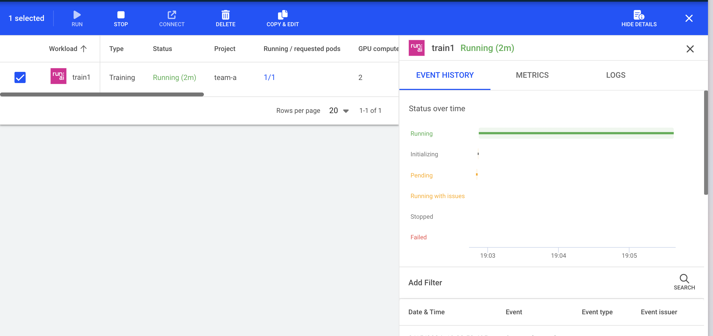
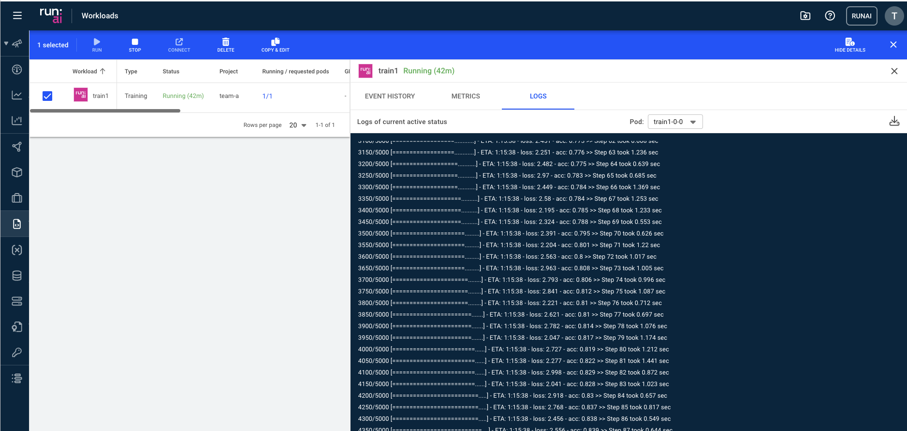

# Quickstart: Launch Unattended Training Workloads

## Introduction

The purpose of this article is to provide a quick ramp-up to running an unattended training Workload. Training Workloads are containers that run a task on start and close down automatically when the task is done. 

With this Quickstart you will learn how to:

*   Start a deep learning __training__ workload.
*   View training workload status and resource consumption using the Run:ai user interface and the Run:ai CLI.
*   View training workload logs.
*   Stop the training workload.

To submit a workload you can use the Run:ai _command-line interface (CLI)_ or the _Run:ai user interface_. 

## Prerequisites 

To accomplish this Quickstart, the [Platform Administrator](../../platform-admin/overview.md) will need to provide you with:

* _Researcher_ access to Run:ai 
* To a Project named "team-a"
* With at least 1 GPU assigned to the project. 
* A link to the Run:ai Console. E.g. [https://acme.run.ai](https://acme.run.ai).
* To complete this Quickstart __via the CLI__, you will need to have the Run:ai CLI installed on your machine. There are two available CLI variants:
    * The older V1 CLI. See installation [here](../../admin/researcher-setup/cli-install.md)
    * A newer V2 CLI, supported with clusters of version 2.18 and up. See installation [here](../../admin/researcher-setup/new-cli-install.md)

## Step by Step Walkthrough

### Login

=== "CLI V1"
    Run `runai login` and enter your credentials.

=== "CLI V2"
    Run `runai login` and enter your credentials.

=== "User Interface"
    Browse to the provided Run:ai user interface and log in with your credentials.

### Run Workload


=== "CLI V1"
    Open a terminal and run:

    ``` bash
    runai config project team-a   
    runai submit train1 -i gcr.io/run-ai-demo/quickstart -g 1
    ```

=== "CLI V2"
    Open a terminal and run:

    ``` bash
    runai project set team-a
    runai training submit train1 -i gcr.io/run-ai-demo/quickstart -g 1
    ```

=== "User Interface"
    * In the Run:ai UI select __Workloads__
    * Select __New Workload__ and then __Training__
    * You should already have `Cluster`, `Project` and a `start from scratch` `Template` selected. Enter `train1` as the name and press __CONTINUE__.
    * Select __NEW ENVIRONMENT__. Enter `quickstart` as the name and `gcr.io/run-ai-demo/quickstart` as the image. Then select __CREATE ENVIRONMENT__.
    * When the previous screen comes up, select `one-gpu` under the Compute resource. 
    * Select __CREATE TRAINING__.


This would start an unattended training Workload for `team-a` with an allocation of a single GPU. The Workload is based on a [sample](https://github.com/run-ai/docs/tree/master/quickstart/main){target=_blank} docker image ``gcr.io/run-ai-demo/quickstart``. We named the Workload ``train1``

### List Workloads

Follow up on the Workload's progress by running:

=== "CLI V1"
    ``` bash
    runai list jobs
    ```
    The result:
    

=== "CLI V2"
    ``` bash
    runai training list
    ```

    The result:

    ```
    Workload               Type        Status      Project     Preemptible      Running/Requested Pods     GPU Allocation
    ────────────────────────────────────────────────────────────────────────────────────────────────────────────────────────
    train1                 Training    Running     team-a      Yes              1/1                        0.00
    ```

=== "User Interface"
    * Open the Run:ai user interface.
    * Under "Workloads" you can view the new Training Workload:

    

    Select the Workloads and press `Show Details` to see the Workload details

     


    Under Metrics you can see utilization graphs:

    


Typical statuses you may see:

*   ContainerCreating - The docker container is being downloaded from the cloud repository
*   Pending - the Workload is waiting to be scheduled
*   Running - the Workload is running
*   Succeeded - the Workload has ended

A full list of Workload statuses can be found [here](../scheduling/job-statuses.md) 

### Describe Workload

To get additional status on your Workload run:

=== "CLI V1"
    ``` bash
    runai describe job train1
    ```

=== "CLI V2"
    ``` bash
    runai training describe train1
    ```

=== "User Interface"
    Workload parameters can be viewed by adding more columns to the Workload list and by reviewing the `Event History` tab for the specific Workload. 

### View Logs

Run the following:

=== "CLI V1"
    ```
    runai logs train1
    ```

    You should see a log of a running container:

    

=== "CLI V2"
    ``` bash
    runai training logs train1
    ```

    You should see a log of a running container:

    

=== "User Interface"
    Select the Workload, and press __Show Details__. Under `Logs` you can see the logs emitted from the container

    


### Stop Workload

Run the following:

=== "CLI V1"
    ``` bash
    runai delete job train1
    ```

=== "CLI V2"
    ```    
    runai training delete train1
    ```

=== "User Interface"
    Select the Workload and press __DELETE__.

This would stop the training workload. You can verify this by [listing](#list-workloads) training workloads again.

## Next Steps

*   Follow the Quickstart document: [Launch Interactive Workloads](walkthrough-build.md).
*   Use your container to run an unattended training workload.