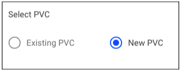

# Persistent Volumes (PVs) & Persistent Volume Claims (PVCs)

Persistent Volumes (PVs) and Persistent Volume Claims (PVCs) are concepts in Kubernetes for managing storage. A PV is a piece of storage in the cluster, provisioned by an administrator or dynamically by Kubernetes using a StorageClass. It is a resource in the cluster, just like a node is a cluster resource. 

PVCs are requests for storage by a user. They are similar to pods, in that pods consume node resources and PVCs consume PV resources. PVCs allow users to request specific sizes and access modes (for example, read/write once, read-only many) without needing to know the details of the underlying storage infrastructure.

Using PVs and PVCs in Kubernetes is essential for AI workloads as they provide a reliable and consistent way to manage storage that persists beyond the lifecycle of individual pods. This ensures that data generated by AI workloads is not lost when pods are rescheduled or updated, providing a seamless and efficient storage solution that can handle the large datasets typically associated with AI projects.

## Data source of type Persistent Volume Claim (PVC)

At Run:ai, a data source of type PVC is an abstraction, mapping directly to a Kubernetes PVC. This type of integration allows you to specify and manage your data storage requirements within the Run:ai platform, while using familiar Kubernetes storage concepts. 

By leveraging PVCs as data sources, Run:ai enables access to persistent storage for workloads, ensuring that data remains consistent and accessible across different compute resources and workload executions.

## Creating a data source of type PVC via the UI

Like any other asset, when creating a data source, the user can select the scope of the data source, based on their permissions set in Run:ai’s Role Based Access Control (RBAC) system.

For example: By selecting Department B as the scope of the asset, any user with a role which allows them to view the data source in Department A or any of its subordinate units (current and future) can view this PVC.  

There are two different ways of creating data source of type PVC:

1. **Existing PVC**&mdash;Data source of type PVC using an existing PVC in the cluster  
1. **New PVC**&mdash;Data source of type PVC by creating a new pvc in the cluster

!!! NOTE
    If there are no existing PVCs that Run:ai has visibility or authorization to use, this option is disabled in the Run:ai platform. For details on providing visibility and authorization, see below Existing PVC.

## Existing PVC

To select an existing PVC in the Run:ai platform, the admin is responsible for performing a number of actions prior to creating the data source via the Run:ai UI (or API). These actions provide Run:ai with access to the existing PVC, authorization to share across the selected scope and eventually result in exposing the existing PVC in the UI for the user to select.

Click the link for more information on [creating a data source of type PVC via API](https://envinaclickstaging.staging.run.ai/api/docs\#tag/PVC/operation/create\_pvc\_asset).

The actions taken by the admin are based on the scope (cluster, department or project) that the admin wants for data source of type PVC.

### For a cluster scope

1. Locate the PVC in the runai namespace  
1. Provide Run:ai with visibility and authorization to share the PVC to your selected scope by implementing the following label:  
   [run.ai/cluster-wide](http://run.ai/cluster-wide): "true"

!!!NOTE
   This step is also relevant for creating the data source of type PVC via API.

In the Run:ai platform finish creating the data source of type PVC:

1. Select your cluster as a scope  
   1. Select the existing PVC  
   1. Complete all mandatory fields  
   1. Click Create

### For a department scope:

1. Locate the PVC in the runai namespace  
1. Provide Run:ai with visibility and authorization to share the PVC to your selected scope by implementing the following label:  
   [run.ai/department](http://run.ai/department): "\<name of department\>"  
1. In the Run:ai platform finish creating the data source of type PVC:  
   1. Select you department as a scope (the same one as in the label)  
   1. Select the existing PVC  
   1. Complete all mandatory fields  
   1. Click Create

### For a project scope:

!!! NOTE
    For project scope, no labels are required.

1. In the Run:ai platform finish creating the data source of type PVC:  
   1. Select your project as a scope  
   1. Select the existing PVC  
   1. Complete all mandatory fields  
   1. Click Create

## Creating a new PVC

When creating a data source of type PVC using a new PVC, Run:ai creates the PVC for you in the cluster.

1. Select your scope of choice  
1. Select new PVC  
1. Complete all mandatory fields  
1. Click Create

**NOTES**:

* When creating data source of type PVC using a new PVC, the PVC is created immediately in the cluster runai namespace (even if no workload has requested to use this PVC)  
* A PVC created in the cluster by selecting the option “New PVC” never appears as a PVC in the “Existing PVC“ option.