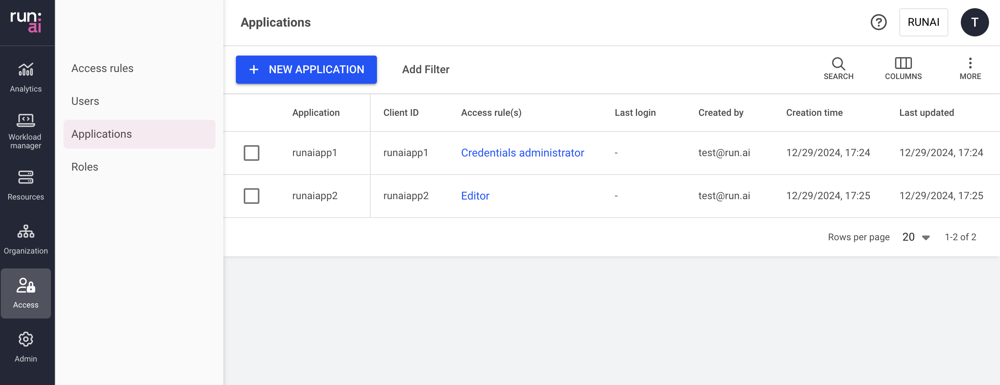

This article explains the procedure to manage applications.

Applications are used for API integrations with Run:ai. An application contains a client secret. With the client secret you can obtain a token and use it within subsequent API calls.

Applications are managed locally and assigned with Access Rules to manage permissions.

For example, application **ci-pipeline-prod** assigned with a **Researcher** role in **Cluster: A**. TBD

## Applications table

The Applications table can be found under **Access** in the Run:ai platform.

The Applications table provides a list of all the applications defined in the platform, and allows you to manage them. TBD: not personal applications?

TBD: add new screenshot

The Applications table consists of the following columns:

| Column | Description |
| :---- | :---- |
| Application | The name of the application |
| client ID | The name of the application TBD | 
| Status | The status of the application |
| Access rule(s) | The access rules assigned to the application |
| Last login | The timestamp for the last time the user signed in |
| Created by | The user who created the application |
| Creation time | The timestamp for when the application was created |
| Last updated | The last time the application was updated |

TBD: client ID same as app name but not in personal application

### Customizing the table view

* Filter \- Click ADD FILTER, select the column to filter by, and enter the filter values  
* Search \- Click SEARCH and type the value to search by  
* Sort \- Click each column header to sort by  
* Column selection \- Click COLUMNS and select the columns to display in the table  
* Download table \- Click MORE and then Click Download as CSV

## Creating an application

To create an application:

1. Click **\+NEW APPLICATION**  
2. Enter the application’s **name**  
3. Click **CREATE**  
4. Copy the **Client ID** and **Client secret** and store them securely
5. Click **DONE**

!!!Note
    The client secret is visible only at the time of creation. It cannot be recovered but can be regenerated.

## Adding an access rule to an application

To create an access rule:

1. Select the application you want to add an access rule for  
2. Click **ACCESS RULES**  
3. Click **\+ACCESS RULE**  
4. Select a role  
5. Select a scope  
6. Click **SAVE RULE**  
7. Click **CLOSE**

## Deleting an access rule from an application

To delete an access rule:

1. Select the application you want to remove an access rule from  
1. Click **ACCESS RULES**  
1. Find the access rule assigned to the user you would like to delete  
1. Click on the trash icon  
1. Click **CLOSE**

## Regenerating client secret

To regenerate a client secret:

1. Locate the application you want to regenerate its client secret 
2. Click **REGENERATE CLIENT SECRET**  
3. Click **REGENERATE**  
4. Copy the **New client secret** and store it securely
5. Click **DONE**

!!!Warning
    Regenerating a client secret revokes the previous one.

## Deleting an application

1. Select the application you want to delete  
1. Click **DELETE**  
1. On the dialog, click **DELETE** to confirm the deletion

## Using API

Go to the [Applications](https://app.run.ai/api/docs#tag/Applications), [Access rules](https://app.run.ai/api/docs#tag/Access-rules) API reference to view the available actions

