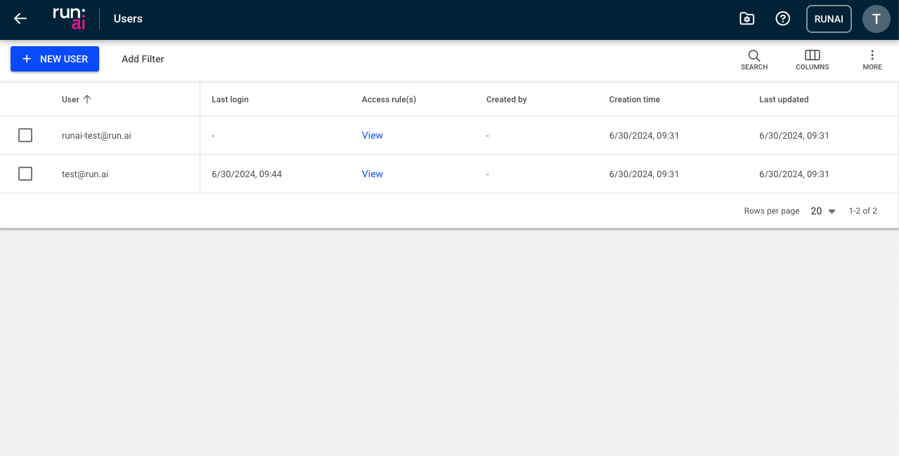

This article explains the procedure to manage users and their permissions.

Users can be managed locally, or via the Identity provider, while assigned with Access Rules to manage its permissions.

For example, user **user@domain.com** is a **department admin** in **department A**.

## Users table

The Users table can be found under **Tools & Settings** in the Run:ai platform.

The users table provides a list of all the users in the platform.  
You can manage local users and manage user permissions (access rules) for both local and SSO users.

!!! Note
    __Single Sign-On users__

    SSO users are managed by the identity provider and appear once they have signed in to Run:ai

The Users table consists of the following columns:

| Column | Description |
| :---- | :---- |
| User | The unique identity of the user (email address) |
| Type | The type of the user \- SSO / local |
| Last login | The timestamp for the last time the user signed in |
| Access rule(s) | The access rules assigned to the user |
| Created By | The user who created the user |
| Creation time | The timestamp for when the user was created |
| Last updated | The last time the user was updated |

### Customizing the table view

* Filter - Click ADD FILTER, select the column to filter by, and enter the filter values  
* Search - Click SEARCH and type the value to search by  
* Sort - Click each column header to sort by  
* Column selection - Click COLUMNS and select the columns to display in the table  
* Download table - Click MORE and then Click Download as CSV

## Creating a local user

To create a local user:

1. Click **\+NEW LOCAL USER**  
1. Enter the user’s **Email address**  
1. Click **CREATE**  
1. Review and copy the user’s credentials:  
    * **User Email**  
    * **Temporary password** to be used on first sign-in  
1. Click **DONE**

!!! Note
    The temporary password is visible only at the time of user’s creation, and must be changed after the first sign-in

## Adding an access rule to a user

To create an access rule:

1. Select the user you want to add an access rule for  
1. Click **ACCESS RULES**  
1. Click **\+ACCESS RULE**  
1. Select a role  
1. Select a scope  
1. Click **SAVE RULE**  
1. Click **CLOSE**

## Deleting user’s access rule

To delete an access rule:

1. Select the user you want to remove an access rule from  
1. Click **ACCESS RULES**  
1. Find the access rule assigned to the user you would like to delete  
1. Click on the trash icon  
1. Click **CLOSE**

## Resetting a user password

To reset a user’s password:

1. Select the user you want to reset it’s password  
1. Click **RESET PASSWORD**  
1. Click **RESET**  
1. Review and copy the user’s credentials:  
    * **User Email**  
    * **Temporary password** to be used on next sign-in  
1. Click **DONE**

## Deleting a user

1. Select the user you want to delete  
1. Click **DELETE**  
1. In the dialog, click **DELETE** to confirm the deletion

!!!Note
    To ensure administrative operations are always available, at least one local user with System Administrator role should exist.

## Using API

Go to the [Users](https://app.run.ai/api/docs#tag/Users), [Access rules](https://app.run.ai/api/docs#tag/Access-rules) API reference to view the available actions

