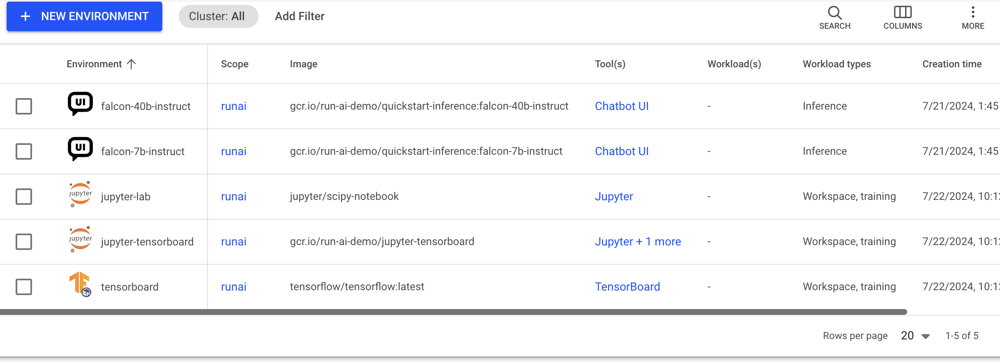

# environments

This article explains what environments are and how to create and use them.

Environments are one type of [workload asset](overview.md). An environment consists of a configuration that simplifies how workloads are submitted and can be used by AI practitioners when they submit their workloads.

An environment asset is a preconfigured building block that encapsulates aspects for the workload such as:

* Container image and container configuration
* Tools and connections
* The type of workload it serves

### Environments table

The Environments table can be found under **Environments** in the Run:ai platform.

The Environment table provides a list of all the environment defined in the platform and allows you to manage them.

The Environments table consists of the following columns:

| Column                | Description                                                                                                                                                                |
| --------------------- | -------------------------------------------------------------------------------------------------------------------------------------------------------------------------- |
| Environment           | The name of the environment                                                                                                                                                |
| Description           | A description of the essence of the environment                                                                                                                            |
| Scope                 | The [scope](overview.md#asset-scope) of this environment within the organizational tree. Click the name of the scope to view the organizational tree diagram               |
| Image                 | The application or service to be run by the workload                                                                                                                       |
| Workload Architecture | This can be either standard for running workloads on a single node or distributed for running distributed workloads on a multiple nodes                                    |
| Tool(s)               | The tools and connection types the environment exposes                                                                                                                     |
| Workload(s)           | The list of existing workloads that use the environment                                                                                                                    |
| Workload types        | The workload types that can use the environment                                                                                                                            |
| Template(s)           | The list of workload templates that use this environment                                                                                                                   |
| Created by            | The user who created the environment. By default Run:ai UI comes with [preinstalled environments](environments.md#tools-associated-with-the-environment) created by Run:ai |
| Creation time         | The timestamp for when the environment was created                                                                                                                         |
| Cluster               | The cluster that the environment is associated with                                                                                                                        |

#### Tools associated with the environment

Click one of the values in the tools column to view the list of tools and their connection type.

| Column          | Description                                                                                                                                                                                                      |
| --------------- | ---------------------------------------------------------------------------------------------------------------------------------------------------------------------------------------------------------------- |
| Tool name       | The name of the tool or application AI practitioner can set up within the environment.                                                                                                                           |
| Connection type | The method by which you can access and interact with the running workload. It's essentially the "doorway" through which you can reach and use the tools the workload provide. (E.g node port, external URL, etc) |

#### Workloads associated with the environment

Click one of the values in the Workload(s) column to view the list of workloads and their parameters.

| Column   | Description                                                                                                                                              |
| -------- | -------------------------------------------------------------------------------------------------------------------------------------------------------- |
| Workload | The workload that uses the environment                                                                                                                   |
| Type     | The workload type (Workspace/Training/Inference)                                                                                                         |
| Status   | Represents the workload lifecycle. see the full list of [workload status](../../../Researcher/workloads/overviews/managing-workloads.md#workload-status) |

#### Customizing the table view

* Filter - Click ADD FILTER, select the column to filter by, and enter the filter values
* Search - Click SEARCH and type the value to search by
* Sort - Click each column header to sort by
* Column selection - Click COLUMNS and select the columns to display in the table
* Download table - Click MORE and then Click Download as CSV

### Environments created by Run:ai

When installing Run:ai, you automatically get the environment created by Run:ai to ease up the onboarding process and support different use cases out of the box.\
These environments are created at the [scope](overview.md#asset-scope) of the account.

| Environment         | Image                                                 |
| ------------------- | ----------------------------------------------------- |
| Jupiter-lab         | jupyter/scipy-notebook                                |
| jupyter-tensorboard | gcr.io/run-ai-demo/jupyter-tensorboard                |
| tensorboard         | tensorflow/tensorflow:latest                          |
| llm-server          | runai.jfrog.io/core-llm/runai-vllm:v0.5.5-0.5.0       |
| chatbot-ui          | runai.jfrog.io/core-llm/llm-app                       |
| gpt2                | runai.jfrog.io/core-llm/quickstart-inference:gpt2-cpu |

### Adding a new environment

Environment creation is limited to [specific roles](overview.md#who-can-create-an-asset)

To add a new environment:

1. Go to the Environments table
2. Click **+NEW ENVIRONMENT**
3. Select under which cluster to create the environment
4. Select a [scope](overview.md#asset-scope)
5. Enter a **name** for the environment. The name must be unique.
6. Optional: Provide a **description** of the essence of the environment
7. Enter the **Image URL**\
   If a token or secret is required to pull the image, it is possible to create it via [credentials of type docker registry](credentials.md#docker-registry). These credentials are automatically used once the image is pulled (which happens when the workload is submitted)
8. Set the **image pull policy** - the condition for when to pull the image from the registry
9. Set the workload architecture:
   * **Standard**\
     Only standard workloads can use the environment. A standard workload consists of a single process.
   * **Distributed**\
     Only distributed workloads can use the environment. A distributed workload consists of multiple processes working together. These processes can run on different nodes.
     * Select a framework from the list.
10. Set the workload type:
    * **Workspace**
    * **Training**
    * **Inference**
      * When inference is selected, define the **endpoint** of the model by providing both the protocol and the container’s serving port
11. Optional: Set the connection for your **tool(s)**. The tools must be configured in the image. When submitting a workload using the environment, it is possible to connect to these tools
    * Select the tool from the list (the available tools varies from IDE, experiment tracking, and more, including a custom tool for your choice)
    * Select the connection type
      * **External URL**
        * **Auto generate**\
          A unique URL is automatically created for each workload using the environment
        * **Custom URL**\
          The URL is set manually
      * **Node port**
        * **Auto generate**\
          A unique port is automatically exposed for each workload using the environment
        * **Custom URL**\
          Set the port manually
      * Set the **container port**
12. Optional: Set a **command and arguments** for the container running the pod
    * When no command is added, the default command of the image is used (the image entrypoint)
    * The command can be modified while submitting a workload using the environment
    * The argument(s) can be modified while submitting a workload using the environment
13. Optional: **Set the environment variable(s)**
    * The environment variable(s) are added to the default environment variables that are already set within the image
    * The environment variables can be modified and new variables can be added while submitting a workload using the environment
    * You can configure a new Environment variable from your credentials (of type generic secret, access key or username & password). When selecting an environment variable source from credentials, the predefined name for the credential assets are displayed as an option. In addition, you can select the type of the credential to be used (username / password or access key / access secret).
14. Optional: Set the container’s **working directory** to define where the container’s process starts running. When left empty, the default directory is used.
15. Optional: Set where the UID, GID and supplementary groups are taken from, this can be:
    * **From the image**
    * **From the IdP token** (only available in an SSO installations)
    * **Custom** (manually set) - decide whether the submitter can modify these value upon submission.
16. Optional: Select **Linux capabilities** - Grant certain privileges to a container without granting all the privileges of the root user.
17. Click **CREATE ENVIRONMENT**

!!! Note It is also possible to add environments directly when creating a specific workspace, training or inference workload

### Editing an environment

To edit an environment:

1. Select the environment from the table
2. Click **Rename** to edit its name and description

!!! Note Additional fields can be edited using the [API](https://app.run.ai/api/docs#tag/Environment)

### Copying & Editing an environment

To copy & edit an environment:

1. Select the project you want to duplicate
2. Click **COPY & EDIT**.
3. Update the environment and click **SAVE**.

### Deleting an environment

To delete an environment:

1. Select the environment you want to delete
2. Click **DELETE**
3. On the dialog, click **DELETE** to confirm the deletion

!!! Note It is not possible to delete an environment being used by an existing workload and template.

### Using API

Go to the [Environment](https://app.run.ai/api/docs#tag/Environment) API reference to view the available actions
