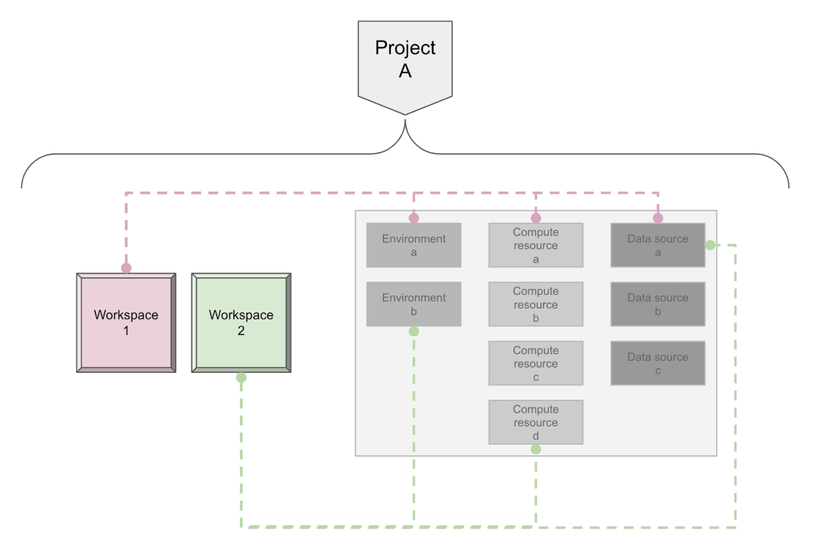
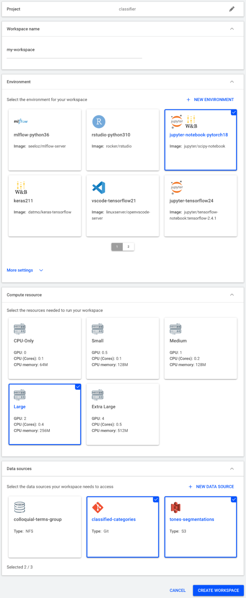

# Workspace Building Blocks

Workspace building blocks are a layer that abstracts complex containers and Kubernetes concepts and provides __simple__ and __reusable__ tools to quickly allocate resources to the workspace. This way researchers need to interact only with the building blocks, and do not need to be aware of technical setups and configurations.

Workspaces are built from the following building blocks:

1. [Environment](environments.md)
2. [Data source](datasources.md)
3. [Compute resource](compute.md)

When a workspace is created, the researcher chooses from preconfigured building blocks or can create a new one on the fly. For example, a workspace can be composed of the following blocks:

* Environment: _Jupyter, Tensor Board and Cuda 11.2_
* Compute resource: _0.5 GPU, 8 cores and 200 Megabytes of CPU memory_
* Data source: _A Git branch with the relevant dataset needed_

## Scopes

A building block has a _scope_. The scope links a building block to a specific Run:ai project or to all projects:   

* When a building block scope is a specific project. It can be viewed and used only within the project.
* A building block scope can also be set to _all projects_ (current projects and also any future ones).

Typically, building blocks are created by the administrator and then assigned to a project. You can grant permission to the researchers to create their own building blocks. These building blocks will only be available to the projects that are assigned to the researcher that created them.

## Who can create an asset?

According to Run:ai’s role-based access control mechanism \- any user, application, or SSO group with a role and permissions to **Create** an asset such as an environment, can do so in the scope of the role.

| Workload asset | Role |
| :---- | :---- |
| Environment | Department administrator |
|  | Editor |
|  | Environment administrator |
|  | L1 researcher |
|  | Research manager |
|  | System administrator |
| Data source | Department administrator |
|  | Editor |
|  | Data source administrator |
|  | L1 researcher |
|  | Research manager |
|  | System administrator |
| Compute resource | Department administrator |
|  | Editor |
|  | Compute resource administrator |
|  | L1 researcher |
|  | Research manager |
|  | System administrator |
| Credentials | Department administrator |
|  | Editor |
|  | Credentials administrator |
|  | L1 researcher |
|  | Research manager |
|  | System administrator |

## Who can use an asset?

Assets are used when submitting workloads, so the ability to use assets is possible when the ability to create workload exists. According to Run:ai’s role-based access control mechanism \- any user, application, or SSO group with the required role and permission can **Create** a workload/inference in the scope of the role.

| Workload type | Role |
| :---- | :---- |
| Workload or Inference | Department administrator |
|  | Editor |
|  | L1 researcher |
|  | L2 researcher |
|  | ML engineer |
|  | System administrator |

## Who can view an asset?

According to Run:ai’s role-based access control mechanism - any user, application, or SSO group with a role with permission to **View** an asset, such as environment, can do so in the scope of the role.

| Workload asset | Role |
| :---- | :---- |
| Environment | Compute resource administrator |
|  | Department administrator |
|  | Editor |
|  | Environment administrator |
|  | L1 researcher |
|  | Research manager |
|  | System administrator |
| Data source | Department administrator |
|  | Editor |
|  | Data source administrator |
|  | L1 researcher |
|  | Research manager |
|  | System administrator |
| Compute resource | Department administrator |
|  |  |
|  | Editor |
|  | Compute resource administrator |
|  | L1 researcher |
|  | Research manager |
|  | System administrator |
| Credentials | Department administrator |
|  | Editor |
|  | Credentials administrator |
|  | L1 researcher |
|  | Research manager |
|  | System administrator |

