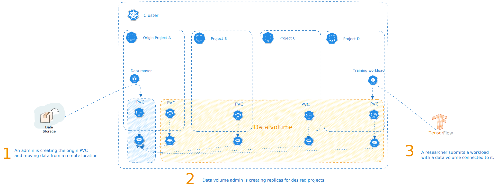

Data Volumes offer a powerful solution for storing, managing, and sharing AI training data within your Run.ai environment. This functionality promotes collaboration, simplifies data access control, and streamlines the AI development lifecycle.

## What are Data Volumes

Data Volumes are snapshots of datasets stored in Kubernetes Persistent Volume Claims (PVCs). They act as a central repository for training data, and offer several key benefits.

* Managed with dedicated permissions&mdash;Data admins, a new role within Run.ai, have exclusive control over data volume creation, data population, and sharing.
* Shared between multiple scopes&mdash;Unlike other Run:ai data sources, data volumes can be shared across projects, departments, or clusters. This promotes data reuse and collaboration within your organization.
* Coupled to workloads in the submission process&mdash; Similar to other Run:ai data sources, Data volumes can be easily attached to AI workloads during submission, specifying the data path within the workload environment.

!!! Note
    Data volumes are not versioned.

## Data volumes use cases

The following are typical use cases for Data Volumes:

* Sharing large data sets with multiple researchers in my organization&mdash;Sometimes we have data located in a remote location. After moving it inside the cluster, sharing it easily with multiple users is still hard. Data volumes can help you do that seamlessly and with maximum security and control
* Sharing data created during the AI work cycle&mdash;When it is needed to share training results, generated data sets or other artifacts with our team members. Data volume helps you take your data and share it with your colleagues.

## Data volumes authorization

There is now a new role called `Data Volumes Administrator` which contains the following two sets of permissions and allows you to manage your Data Volumes easily.

!!! Note
    CRUD = *Create*, *Read*, *Update*, and *Delete*.

Data Volumes administrator contains two permission entities:

* Data volumes - CRUD
* Data volumes - sharing list - CRUD

Data volumes (should have the origin project in the scope)

* Can create DV in the scope
* Can read DV in the scope
* Can update DV in the scope
* Can delete DV in the scope

Data volumes - sharing list

* Can Share DV in the scope
* Can unshare DV from the scope

### Data volume administrator permissions

| Entity | Permissions |
| --- |  --- |
| Data volumes  | CRUD |
| Data volumes - sharing list | CRUD |
| Account | R |
| Department | R |
| Project | R |
| Jobs | R |
| Workloads | R |
| Cluster | R |
| Overview dashboard | R |
| Consumption dashboard | R |
| Analytics dashboard | R |
| Policies | R |
| workloads | R |
| Workspaces | R |
| Trainings | R |
| Environments | R |
| Compute resources | R |
| Templates | R |
| Data source | R |
| Inferences | R |

### Data volume permissions for each role

| Role | DV permissions |
| --- |------------|
| Data volume administrator | DV CRUD, Sharing CRUD |
| System administrator | DV CRUD, Sharing CRUD |
| Department admin | DV CRUD, Sharing CRUD |
| Department viewer | DV R       |
| Researcher manager | DV CRUD, Sharing CRUD |
| Editor | DV CRUD, Sharing CRUD |
| L1 | DV CRUD    |
| L2 | DV R       |
| ML engineer | DV R       |
| Assets admins  | DV R       |
| Application admin | DV R       |
| Viewer | DV R       |

## Using Data volumes

This section outlines the procedure for creating, sharing, and submitting (Researcher) data volumes.

### Creating Data Volumes

!!! Note
    Data volume admins can create data volumes within specific projects. Since data volumes are created from PVCs, there has to be a PVC in the namespace of a run:ai project, and a PV bound to it, for Run:Ai to have access to it and create the Data volume from it. Once the DV is created, the admin manages its sharing configurations.

Data Volumes are created using the API endpoint. For more information, see [Data Volumes](https://app.run.ai/api/docs#tag/Data-Volumes)

### Sharing Data volumes

Sharing permissions is a sub-entity of the Data volume management permissions. Meaning they can be assigned independently. A user can have permission to create a DV but not to share it. A data volume can be shared with one or multiple scopes. In all the scopes that the DV is shared, it can be used by the users in their workloads.

Data Volumes are shared using the API endpoint. For more information, see [Data Volumes](https://app.run.ai/api/docs#tag/Data-Volumes){target=_blank}.

### Using Data Volumes in Workloads

You can attach a data volume to a workload during submission in the same way other data sources are used. You need to specify the desired data path within the data source parameters.

Researchers can list available data volumes within their permitted scopes for easy selection.

For more information on using a data volume when submitting a workload, see [Submitting Workloads](../submitting-workloads.md).

You can also add a data volumes to your workload when submitting a workload via the API. For more information, see [Workloads](https://app.run.ai/api/docs#tag/Workloads).
