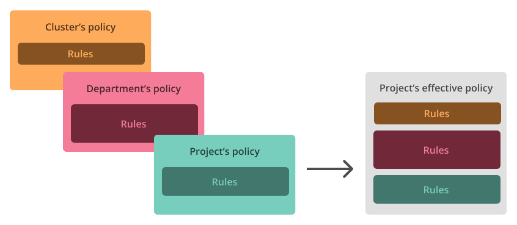

  

At Run:ai, Administrator can access a suite of tools designed to facilitate efficient account management. This article focuses on two key features: workload policies and workload scheduling rules. These features empower admins to establish default values and implement restrictions allowing enhanced control, assuring compatibility with organizational policies and optimizing resources usage and utilization.

## Workload policies

A workload policy is an end-to-end solution for AI managers and administrators to control and simplify how workloads are submitted. This solution allows them to set best practices, enforce limitations, and standardize processes for the submission of workloads for AI projects within their organization. It acts as a key guideline for data scientists, researchers, ML & MLOps engineers by standardizing submission practices and simplifying the workload submission process.

## Older and Newer Policy technologies

Run:ai provides two policy technologies.

[**YAML-Based policies**](old-policies.md) are the older policies. These policies:

* Require access to Kubernetes to view or change.
* Contact Run:ai support to convert the old policies to the new V2 policies format.

[**API-based policies**](workspaces-policy.md) which are the newer policies. These are:

* Show in the Run:ai user interface.
* Can be viewed and modified via the user interface and the Control-plane API.
* Enable new rules addressing differences between project, department and cluster policies.
* Only available with Run:ai clusters of version 2.18 and up. 

### Why use a workload policy?

Implementing workload policies is essential when managing complex AI projects within an enterprise for several reasons:

1. Resource control and management  
    Defining or limiting the use of costly resources across the enterprise via a centralized management system to ensure efficient allocation and prevent overuse.  
2. Setting best practices  
    Provide managers with the ability to establish guidelines and standards to follow, reducing errors amongst AI practitioners within the organization.  
3. Security and compliance  
   Define and enforce permitted and restricted actions to uphold organizational security and meet compliance requirements.  
4. Simplified setup  
   Conveniently allow setting defaults and streamline the workload submission process for AI practitioners.  
5. Scalability and diversity  
    1. Multi-purpose clusters with various workload types that may have different requirements and characteristics for resource usage.  
    2. The organization has multiple hierarchies, each with distinct goals, objectives and degrees of flexibility.  
    3. Manage multiple users and projects with distinct requirements and methods, ensuring appropriate utilization of resources.

### Understanding the mechanism

The following sections provide details of how the workload policy mechanism works.

#### Cross-interface enforcement

The policy enforces the workloads regardless of whether they were submitted via UI, CLI, Rest APIs, or Kubernetes YAMLs.

#### Policy types

Run:ai’s policies enforce Run:ai workloads. The policy type is per Run:ai workload type. This allows administrators to set different policies for each workload type.

| Policy type |  | Workload type |  | Kubernetes name |
| ----- | :---- | ----- | :---- | ----- |
| Workspace |  | Workspace |  | Interactive workload |
| Training | Standard | Training | Standard | Training workload |
|  | Distributed\* |  | Distributed | Distributed workload |
| Inference\* |  | Inference |  | Inference workload |

\* The submission of these policy types is supported currently via API only

### Policy structure \- rules, defaults, and imposed assets

A policy consists of rules for limiting and controlling the values of fields of the workload. In addition to rules, some defaults allow the implementation of default values to different workload fields. These default values are not rules, as they simply suggest values that can be overridden during the workload submission.

Furthermore, policies allow the enforcement of workload assets. For example, as an admin, you can impose a data source of type PVC to be used by any workload submitted.

For more information see [rules](policy-reference.md#rules), [defaults](policy-reference.md#defaults) and [imposed](policy-reference.md#imposed-assets) assets.

### Scope of effectiveness

Numerous teams working on various projects require the use of different tools, requirements, and safeguards. One policy may not suit all teams and their requirements. Hence, administrators can select the scope to cover the effectiveness of the policy. When a scope is selected, all of its subordinate units are also affected. As a result, all workloads submitted within the selected scope are controlled by the policy.

For example, if a policy is set for Department A, all workloads submitted by any of the projects within this department are controlled.

A scope for a policy can be:  

        The entire account  
            L Specific cluster  
                L Specific department  
                    L Specific project

!!! Note
     The policy submission to the entire account scope is supported via API only

The different scoping of policies also allows the breakdown of the responsibility between different administrators. This allows delegation of ownership between different levels within the organization. The policies, containing rules and defaults, propagate\* down the organizational tree, forming an “effective” policy that enforces any workload submitted by users within the project.

* If a rule for a specific field is already occupied by a policy in the organization, another unit within the same branch cannot submit an additional rule on the same field. As a result, administrators of higher scopes must request lower-scope administrators to free up the specific rule from their policy. However, defaults of the same field can be submitted by different organizational policies, as they are “soft” rules that are not critical to override, and the smallest level of the default is the one that becomes the effective default (project default ‚”wins” vs department default, department default “wins” vs cluster default etc.).

## Run:ai Policies vs. Kyverno Policies

Kyverno runs as a dynamic admission controller in a Kubernetes cluster. Kyverno receives validating and mutating admission webhook HTTP callbacks from the Kubernetes API server and applies matching policies to return results that enforce admission policies or reject requests. Kyverno policies can match resources using the resource kind, name, label selectors, and much more. For more information, see [How Kyverno Works](https://kyverno.io/docs/introduction/#how-kyverno-works).

